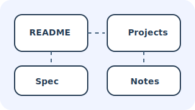

# Project Spec

The sample SPA must satisfy the following:

- Render Markdown with headings, lists, inline formatting, and fenced code blocks.
- Copy static assets such as images into the `docs/` deployment folder.
- Build navigation metadata that powers breadcrumbs and sidebar listings.

## Acceptance Criteria

1. `python build.py examples/sample-vault -o docs` regenerates the entire static site.
2. The home page loads without console errors.
3. Breadcrumbs always begin with a **Root** crumb, followed by folder names, ending with the current page.

